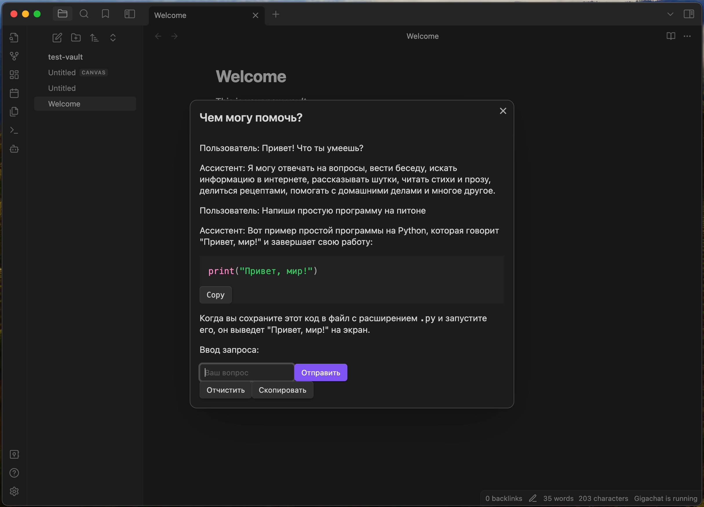

# Obsidian plugin with gigachat support

## Зависимости

- node js
- make - используется для сборки

## Сборка

Собрать плагин можно через `make build`. В папке build/ появится папка с плагином, которую затем можно подложить в качестве плагина в obsidian [в соответствие с инструкцией](https://docs.obsidian.md/Plugins/Getting+started/Build+a+plugin#Step+3+Enable+the+plugin).
